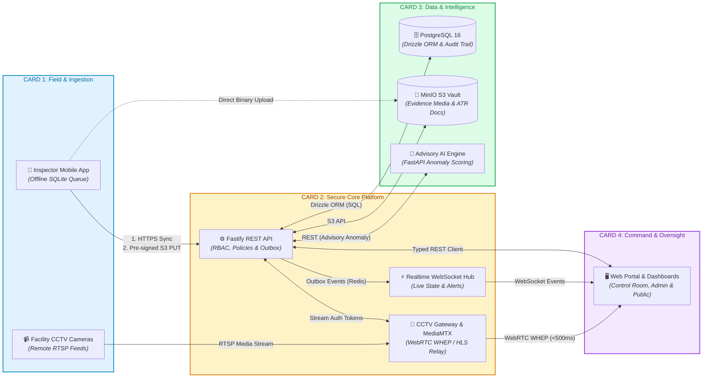
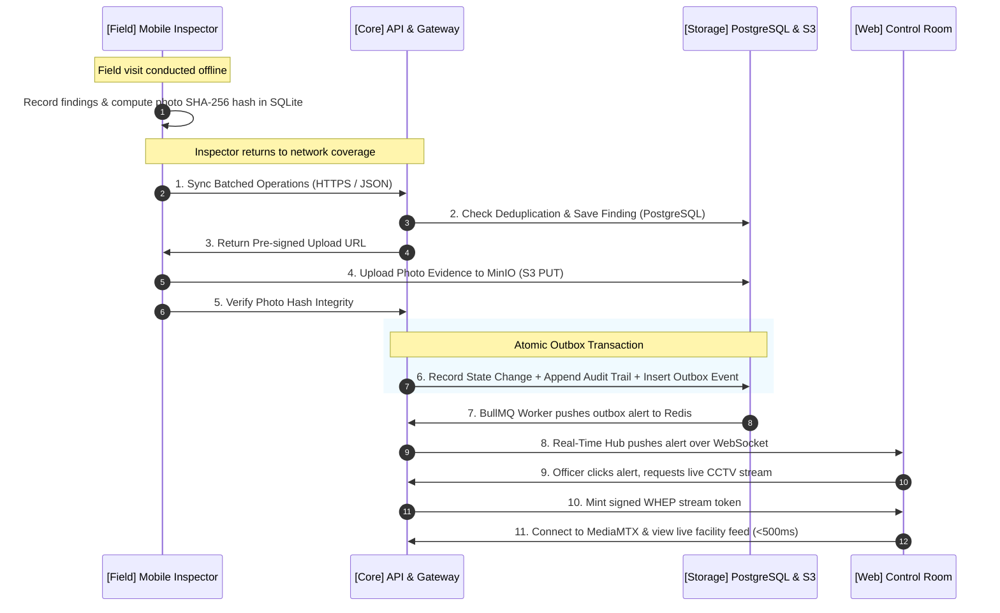

# Netram System Architecture

**Authority:** This is the canonical architecture overview for **Netram**. It describes the system as implemented. For historical context and design evolution, consult [`docs/history/`](../history/) and [`docs/decisions/`](../decisions/) (ADRs).

---

## 1. High-Level Visual Architecture (Modular Flow Cards)

---

## 2. Modular Architecture Tiers

### 📇 Tier 1: Field & Ingestion
* **Components:**
  * **Inspector Mobile Application** (`apps/inspector-mobile` — React Native / Expo)
  * **Facility CCTV Cameras & NVRs** (Edge RTSP feeds)
* **Responsibilities:**
  * Captures on-site inspection observations, geotags, and photographic evidence.
  * Operates offline in remote locations with zero network connectivity via local SQLite.
  * Streams surveillance footage inside facility local networks without exposing credentials.
* **Connectivity:**
  * ➡️ **Core API:** Reconciles queued operations idempotently upon network reconnect (`POST /api/v1/inspections/sync`).
  * ➡️ **MinIO Object Storage:** Uploads high-resolution evidence media using pre-signed S3 URLs with SHA-256 capture-time checksums.
  * ➡️ **CCTV Gateway:** Serves RTSP video streams across the network perimeter on demand.

---

### 📇 Tier 2: Secure Core Platform & Gateway
* **Components:**
  * **Core REST API** (`services/api` — Fastify modular monolith)
  * **Real-Time Hub** (`services/realtime` — Fastify + WebSockets)
  * **CCTV Gateway** (`services/cctv-gateway` — MediaMTX integration bridge)
* **Responsibilities:**
  * Acts as the single authoritative enforcement point for RBAC, Jurisdiction, and Workflow rules.
  * Bridges internal RTSP cameras to browser-friendly WebRTC (WHEP) without exposing camera credentials.
  * Guarantees event delivery consistency via the Transactional Outbox pattern.
* **Connectivity:**
  * ⬅️ **Field:** Authenticates field devices and validates offline sync batches.
  * ➡️ **Storage & AI:** Persists domain state to PostgreSQL and requests advisory anomaly scores.
  * ➡️ **Web Control Room:** Serves management APIs, issues signed stream tokens, and broadcasts live WebSocket alerts.

---

### 📇 Tier 3: Data & Intelligence Vault
* **Components:**
  * **Relational Database** (PostgreSQL 16 via Drizzle ORM in `packages/data`)
  * **Object Storage Vault** (MinIO S3 Bucket)
  * **Advisory AI Engine** (`services/ai` — Python / FastAPI)
  * **Distributed Broker & Background Workers** (Redis 7 + BullMQ)
* **Responsibilities:**
  * Houses all authoritative project records, user identities, inspection findings, and append-only audit trails.
  * Stores tamper-evident media, photo evidence, and Action Taken Reports (ATR).
  * Evaluates anomaly scores advisory-only (never acts as the final judge; outputs reviewable metrics).
* **Connectivity:**
  * ⬅️ **Core API:** Executes transactional persistence queries, manages background job queues, and runs AI inference.
  * ➡️ **Web Control Room:** Provides verified evidence files and structured audit trails.

---

### 📇 Tier 4: Command, Control & Oversight
* **Components:**
  * **Next.js Web Platform** (`apps/web` — App Router + React 19)
  * **Control Room & Monitoring Dashboards**
  * **Public Grievance & Tracking Portal**
* **Responsibilities:**
  * Provides real-time situational awareness to State, District, and Institutional authorities.
  * Enables live CCTV multi-camera wall monitoring with sub-500ms latency.
  * Manages complaint filing, project verification, and corrective action issuance.
* **Connectivity:**
  * ⬅️ **Core API:** Loads operational dashboards, projects, and inspection results.
  * ⬅️ **CCTV Gateway (MediaMTX):** Receives sub-second live video feeds directly in the browser.
  * ⬅️ **Real-Time Hub:** Subscribes to live outbox notifications, risk alerts, and state transitions.

---

## 3. End-to-End Operational Lifecycle Flow

The complete lifecycle of a field inspection, evidence capture, outbox notification, and live CCTV review:

---

## 4. Major Data Flows & Protocols

| Origin | Destination | Protocol / Interface | Data Exchanged |
| :--- | :--- | :--- | :--- |
| **Mobile Client** | **Core API** | `HTTPS / JSON` REST | Offline operation batches, findings, inspection metadata |
| **Mobile Client** | **Object Storage** | `Pre-signed S3 PUT` | Encrypted photo evidence, capture checksums (SHA-256) |
| **Facility Camera** | **CCTV Gateway** | `RTSP / H.264` | Raw video stream from facility cameras |
| **Core API** | **Database** | `Drizzle ORM (SQL)` | Transactional domain state, outbox events, audit records |
| **Core API** | **AI Engine** | `Internal HTTP REST` | Inference payloads & advisory anomaly scores |
| **CCTV MediaMTX** | **Web Browser** | `WebRTC (WHEP)` / `HLS` | Sub-500ms low-latency video feed |
| **Realtime Hub** | **Web Browser** | `WebSockets (WSS)` | Live alerts, metric changes, sync notifications |
| **Web Browser** | **Core API** | `HTTPS / JSON` REST | Administrative reviews, complaint actions, notice issuances |

---

## 5. Mandatory Engineering Boundaries

1. **Persistence Boundary:** Database access lives strictly in `packages/data`. Drizzle ORM, `postgres` drivers, and raw SQL never appear in presentation applications or secondary services (AGENTS.md §8, §9).
2. **Configuration Boundary:** Environment variables flow exclusively through `packages/config` via typed, validated Zod schemas. No naked `process.env` calls outside configuration definitions (AGENTS.md §21).
3. **Cross-Service Contracts:** Communication across service boundaries occurs strictly via typed clients, HTTP REST APIs, or outbox events — never direct source-code imports (AGENTS.md §63).
4. **Server Authority:** The server is the single source of truth for authorization, jurisdiction enforcement, and workflow state. Realtime WebSockets, AI outputs, and client caches are never authoritative (AGENTS.md §16, §28, §36).
5. **No Vendor Leakage:** Infrastructure tools (PostgreSQL, MinIO, MediaMTX, Redis) sit behind abstract domain adapters (AGENTS.md §64).
6. **Server-Side Information Disclosure:** Fields a user is not authorized to view are omitted entirely from backend responses, never hidden client-side via UI logic (AGENTS.md §34).

---

## 6. Subsystem Reference Documents

- **CCTV & Streaming Architecture:** [`docs/architecture/cctv.md`](cctv.md)
- **Domain Model & DoSJE Standards:** [`docs/domain/README.md`](../domain/README.md) and [`docs/DoSJE.md`](../DoSJE.md)
- **API & Package Contracts:** [`docs/contracts/README.md`](../contracts/README.md)
- **Architecture Decisions (ADRs):** [`docs/decisions/`](../decisions/)
- **Deployment Topology:** [`docs/deployment.md`](../deployment.md)
- **Development & Setup:** [`docs/development/setup.md`](../development/setup.md)
- **Mechanical Boundary Checks:** `pnpm check:architecture` (enforced via `scripts/architecture-check.mjs`)
