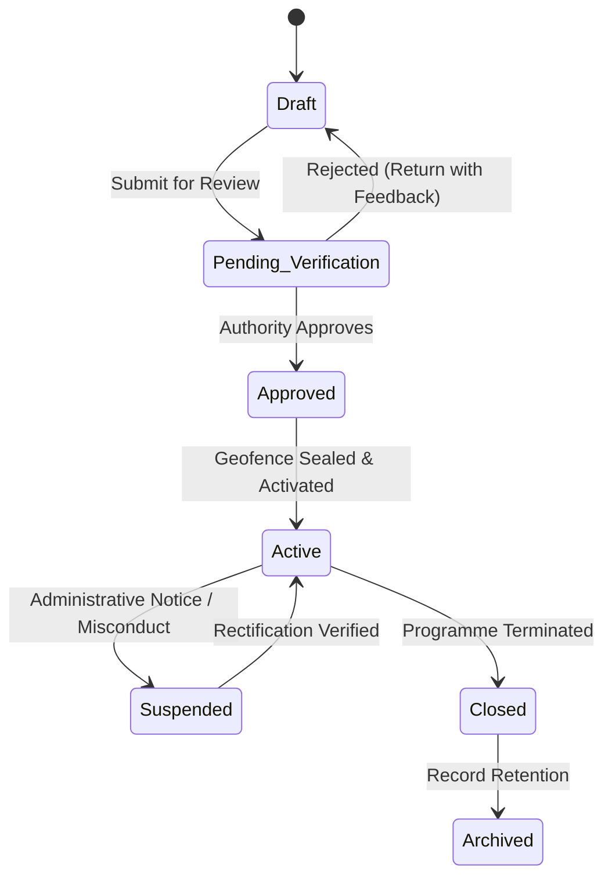

# Netram Domain Model

**Authority:** AGENTS.md §14–17, §30–36.

Netram strictly enforces domain concept separation. Entities must never be collapsed or overloaded merely because they happen to share similar database fields (AGENTS.md §14).

> [!TIP]
> For the comprehensive real-world operational guidelines of the Department of Social Justice & Empowerment (DoSJE), welfare scheme breakdowns (AVYAY, NAPDDR, PM-AJAY, SHRESHTA), and social audit protocols, see [`docs/DoSJE.md`](../DoSJE.md).

---

## 1. Core Domain Concepts

```
User · Role · Permission · RoleAssignment · Authority · Jurisdiction
Organisation · Programme · Project · ProjectPhoto · InspectionTeam · Inspector
Inspection · Observation · Finding · CorrectiveAction · Complaint · Evidence
AIAnomaly · AttendanceCalculation · AttendanceAnomaly · AuditEvent · DomainEvent
```

---

## 2. Identity, Role & Jurisdiction Model

Access control in Netram is a multi-dimensional, server-evaluated policy:

- **`User`**: Core human or machine identity.
- **`Role`**: Named collection of capabilities (`admin`, `inspector`, `authority_officer`, `institution_admin`).
- **`Permission`**: Atomic operational entitlement (`project:create`, `project:approve`, `inspection:review`, `cctv:stream`).
- **`Jurisdiction`**: Geographic scope defining territorial authority (`State` or `District`). A user may hold approval authority in Khordha district while having zero access to Cuttack district.
- **`RoleAssignment`**: The binding of a User to a Role, bounded by an Authority, a Jurisdiction, and an explicit Scope (`national` vs `jurisdiction`).
- **`Policy`**: Server-side evaluators (`AuthorizationService`) that decide access based on identity, active role assignments, resource jurisdiction, and operational context.

*Rule:* Client-side UI visibility toggles are cosmetic. The server re-evaluates complete authorization and jurisdiction on every single API request (AGENTS.md §16–17).

---

## 3. Monitored Projects Lifecycle

All monitored entities (hostels, senior citizen homes, de-addiction centres, schools) progress through a strict, audited state machine:



- **Geofence Enforcement:** Projects are bounded by coordinates and radius. Geofences are verified against field evidence capture metadata (AGENTS.md §40).
- **Audit Immutability:** Every state transition is recorded transactionally in `audit_events` with the actor's identity, timestamp, and justification (AGENTS.md §33).

---

## 4. Inspection, Finding & Remediation (ATR) Pipeline

The inspection lifecycle enforces strict separation between observation, evaluation, and executive remediation:

```
[Field Inspector]                   [Authority Officer]                  [Institution Admin]
       │                                     │                                    │
  Observation                                │                                    │
       ▼                                     │                                    │
    Finding ────────────────────────▶ Authority Review                            │
 (Deficiency)                                │                                    │
                                     Confirmed Finding                            │
                                             │                                    │
                                  Order Corrective Action ───────────────────▶ Lodge ATR
                                             │                                (Evidence)
                                             │                                    │
                                      Verify Resolution ◀─────────────────────────┘
                                             │
                                           Closed
```

1. **Inspector Observation & Evidence:** Inspectors capture tamper-evident field observations with SHA-256 capture-time checksums. Inspectors **never** issue administrative orders or declare guilt.
2. **Authority Review:** Only authorized officers review submitted findings and decide whether to confirm or dismiss them.
3. **Corrective Action Tracking (ATR):** Once confirmed, an Action Taken Report (ATR) order is dispatched to the institution. The institution uploads remediation proof. The authority inspects the proof before closing the action order.

---

## 5. Citizen Grievances & Complaint Escalation

- **Complaints ≠ Confirmed Fraud:** A complaint is an input for inquiry, not a judicial conviction (AGENTS.md §35).
- **Escalation Pathway ([`ADR-003`](../decisions/ADR-003-complaint-escalation-corrective-action.md)):** When an escalated complaint provides unequivocal documented evidence, authorities may issue a direct corrective action order with a recorded "Reviewer's Determination" without fabricating artificial inspection findings.

---

## 6. Advisory AI Anomaly Pipeline

```
Raw Media / Attendance Logs ──▶ Advisory AI Engine (FastAPI) ──▶ Pydantic AnomalyScore ──▶ Human Action Inbox
```

- **Advisory Role:** AI models detect potential attendance anomalies, occupancy divergence, and suspicious activity.
- **Non-Authoritative:** Model outputs represent probabilities and confidence intervals. AI is strictly prohibited from modifying official records, suspending projects, or issuing violation notices (AGENTS.md §36).
- **Review Lifecycle:** Anomalies enter states: `New → Reviewed → Dismissed | Investigated | Acted Upon`.

---

## 7. Tamper-Evident Evidence & Transactional Outbox

- **Evidence Integrity:** Evidence media is hashed client-side at capture time. Backend upload verification confirms byte-equality before marking evidence `verified` (AGENTS.md §30).
- **Durable Events (Transactional Outbox):** State mutations, audit records, and domain events are persisted in a single ACID transaction. The `outbox-dispatcher` worker guarantees durable delivery to subscribers without dual-write inconsistencies (AGENTS.md §26–27).
